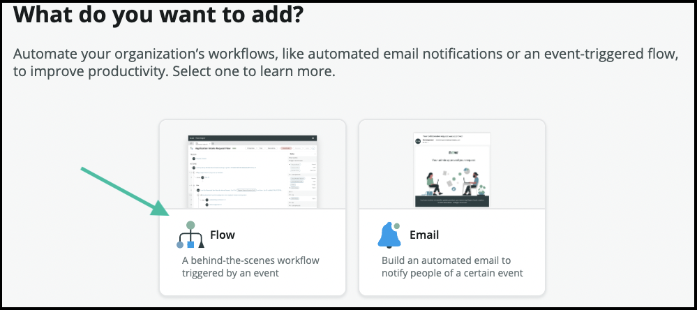
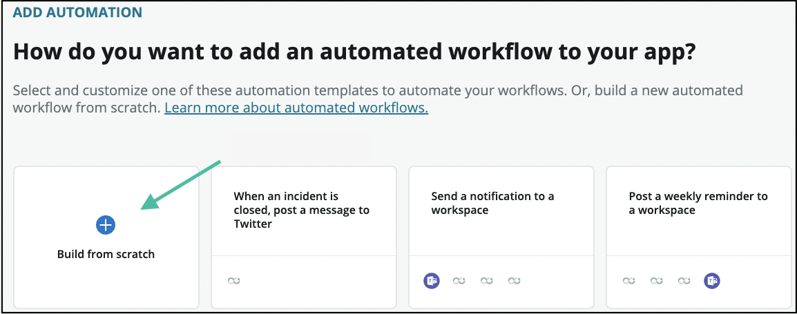
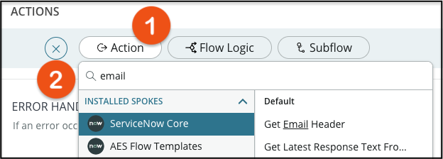
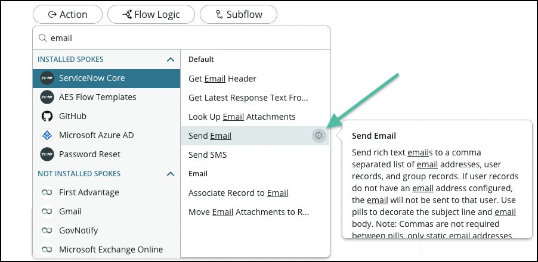

# Guidebook Template

## Goal

This lab will demonstrate how to utilize Flow Designer for sending email notifications. A variety of methods for sending these notifications will be discussed, including:

1. Sending an email through Flow Designer
2. HTML formatted emailing
3. Template based emails.

# Exercise 1 - Using Flow Designer to Send Email

## Goal
In this exercise, we're going to send a plain text email to Gallagher Grey, alerting him that a new hiking party has been created.

## Creating a New Workflow
1. Open the **APPNAME** application up in App Engine Studio.

**SCREENSHOT**

2. Scroll down to the Logic and automation section and click **(+)Add** to create a new workflow.

**SCREENSHOT**

Click on "Flow"

3. We're going to build this one ourselves, so skip the templates and click **"Build from scratch"**.

4. Give your new flow a Name (1) and a Description (2) if the flow needs more explanation and click continue (3)

**SCREENSHOT**

5. The flow is now ready for action! Click on the Edit this flow to start building out the flow.

**SCREENSHOT**

6. We only want this flow to run when certain things happen. These are called Trigger Conditions. Click Add a Trigger.

7. Fill in the following trigger fields
| Field       | Value              |
|-------------|--------------------|
| Trigger     | Updated            |
| Table       | Hiking Parties     |
| Condition   | Status is Approved |
| Run Trigger | Once               |

>Pro Tip: We are only triggering on on the approval of the record, this process will only run one time because we have the Run Trigger drop down set to Once. We don't want to send multiple emails for the same record. Just in case!

8. Click Done to save the trigger conditions.

9. Click the **(+)** button to add an **Action**, **Flow Logic** or **Subflow** to your work flow.
**SCREENSHOT**
10. Click the **Action (1)** button and enter **Email (2)** into the search box.

11. Find the action called **Send Email**. You will see a little **(i)** to the right of the action that will display more information about the action.

12. A bunch of fields will now pop up. Don't worry, not all need to be filled in. We will use the data from the **Trigger - Record Created** data pill.
| Field   | Value                                                                                                                    |
|---------|--------------------------------------------------------------------------------------------------------------------------|
| To      | Gallagher Grey                                                                                                           |
| Subject | A new hiking party has been created!                                                                                     |
| Body    | Dearest Gallagher Grey, A new hiking party named **HIKING PARTY VARIABLE NAME** has been created. **ADD SOME MORE DATA** |

**SCREENSHOT**

13. Click **Done** to save the action.

14. Click **Save** at the top of the flow designer page to save your flow.
>Pro Tip: Clicking the **Save** button is critical in this step, please don't forget it! 

**ADD STEPS FOR CREATING A HIKING PARTY**

1. Navigate back to App Engine Studio and to the flow that we have been creating and click the Test button.

**SCREENSHOT**

2. Now select a Hiking Party and click Run Test. This will now run the workflow.

**SCREENSHOT**

10. The **Test Flow** dialogue will now show a link that will open a new tab that has the detailed execution of the flow.

11. The **Executions** tab shows the detailed output from the workflow so you can see what has happened.

**SCREENSHOT**

12. Lab instances don't actually send email, but that doesn't mean we can't see what it would have looked like! Sent emails are found in the email logs. Navigate back to the main system window and navigate to System Logs > Emails.

**SCREENSHOT**

You should be able to see the email that the system has just generated

**SCREENSHOT**

13. Congratulations! If all has gone well, we're ready to activate our flow. Switch back to the Flow Designer window and click the **Activate** button.

>Pro Tip: Clicking the **Activate** button is just as important as clicking the **Save** button in the previous section. Many hours have been lost trying to figure out why a flow isn't working, only to find out it wasn't activated!

Once you're flow is active, it will now send an email to Gallagher Gray anytime a new hiking party is created automatically!

**Extra Credit**: Instead of having this email sent to a single person, send it to a user group instead. Add more data to the email so Gallagher Gray has more context.

# Exercise 2 - HTML formatted Emails

## Goal
In the previous section, we created a simple email using the data fields. In this section, we're going to build out an email that is sent to the Park Rangers whenever a hike misses their scheduled check-in. It will include an HTML formatted table that has all the data a Park Ranger needs to find the lost hikers.

## Create a new workflow

1. Open the **APPNAME** application up in App Engine Studio.

**SCREENSHOT**

2. Scroll down to the Logic and automation section and click **(+)Add** to create a new workflow.

**SCREENSHOT**

Click on "Flow"

3. Just like before, we'll skip the templates and click **"Build from scratch"**.

4. Give your new flow a Name (1) and a Description (2) if the flow needs more explanation and click continue (3)

**SCREENSHOT**

5. Click **Continue** and then **Edit this flow** to open the workflow for editing.

6. Let's setup the trigger condition for our flow:
| Field      | Value                       |
|------------|-----------------------------|
| Trigger    | Updated                     |
| Table      | Hiking Party                |
| Conditions | Status changes to Emergency |

7. When you're ready, click the **Done** button

**SCREENSHOT**

8. Like in the previous exercise, we're going to add an email action to our flow. But this time we're gonna spice it up with a snazzy table. Click the **Action (1)** button and enter **Email (2)** into the search box.

11. Find the action called **Send Email**. You will see a little **(i)** to the right of the action that will display more information about the action.

12. For the **To** box, drag the **RANGER FIELD NAME** pill over from the Hiking Party record.

13. Set the **Subject** field to start with 
>Lost Hiker Group Alert:&nbsp;  

*Note the space at the end!*

Then pull over the pill from the Hiking Group table labeled "**HIKING GROUP TABLE FIELD**"

**SCREENSHOT**

14. In the **Body** field, click the **Table** button (it looks like a little grid). Then hover over **Insert table**. Another grid will pop up. We need a grid that is 2 columns wide and 7 rows deep.

**SCREENSHOT**

15. Add the following to the table:
| Name        |   |
|-------------|---|
| Leader      |   |
| Start       |   |
| End         |   |
| Destination |   |
 
16. Pull each data pill over from the Hiking Group record.
**SCREENSHOT**

17. Click **Done** and then **Save** the workflow. Let's test this bad boy out!

18. Click the **Test** button at the top of your flow.
**SCREENSHOT**

19. Find a Hiking Group record in the dropdown and click **Run Test**

**SCREENSHOT**

20. Let's see if our notification was sent. Switch back to the main window. In the left navigation pane, type **Emails**. Navigate to **System Logs > Emails** and you should be able to see the email that the system has just generated.

# Exercise 3 - Using templates to send emails

## Goal
In this lab, we'll learn how to convert our email into a template  so our notifications can easily be reconfigured when we share our app with the West Eros National Park.

